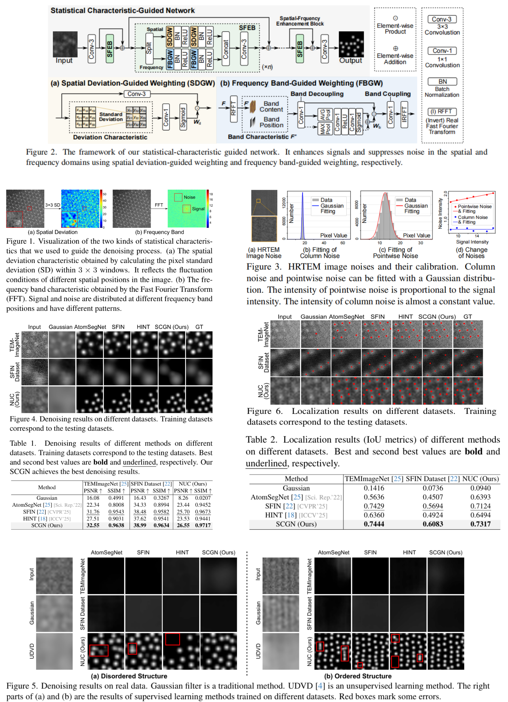

# SCGN
Code and data for CVPR26 paper "Statistical Characteristic-Guided Denoising for Rapid High-Resolution Transmission Electron Microscopy Imaging"
[Paper PDF](https://arxiv.org/abs/2603.18834) 

<p align="center">
  
</p>

# How to use
1. Unzip tem_test_data4.zip. This is the test dataset.
2. Download and unzip tem_data4.zip from [Baidu disk](https://pan.baidu.com/s/14E-IowkhcUrhqSFN9WM7Jg?pwd=f198) or [GoogleDrive](https://drive.google.com/file/d/1E_9R_DXCp8Z9q4kuXGZ5UBAYu0o_wymw/view?usp=sharing). This is the training dataset.
3. Run train_convLast_std_tem_data4.py to train and test our SCGN. convLast_std.py is the SCGN network architecture.
4. Visual results will be saved in "convLast_std_tem_data4_result" folder. PSNR, SSIM, and IOU results will be printed.
5. convLast_std_tem_data4_100.pth is our obtained weight. This will be loaded automatically to test. If you want to retrain, you can delete this weight.

# Citation

If you find the code helpful in your resarch or work, please cite the following paper(s).

```
@article{SCGN,
    title = {Statistical Characteristic-Guided Denoising for Rapid High-Resolution Transmission Electron Microscopy Imaging},
    author = {Li, Hesong and Wu, Ziqi and Shao, Ruiwen and Fu, Ying},
    booktitle = {Proceedings of the IEEE Conference on Computer Vision and Pattern Recognition},
    year = {2026},
}
```
